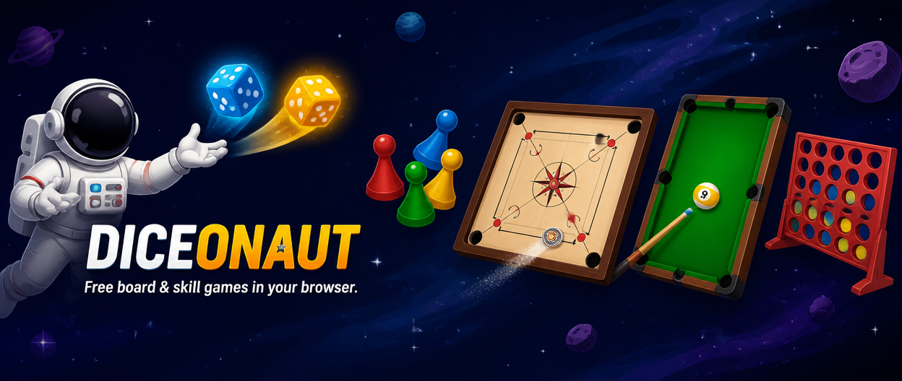
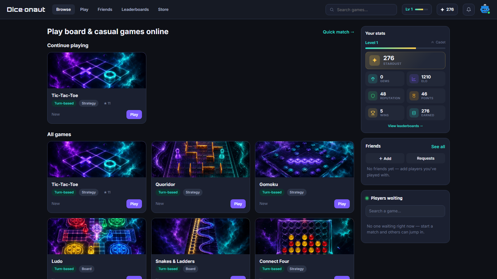
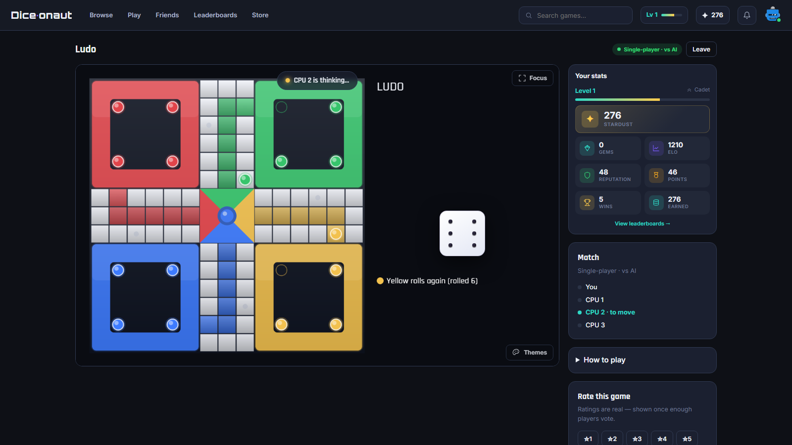
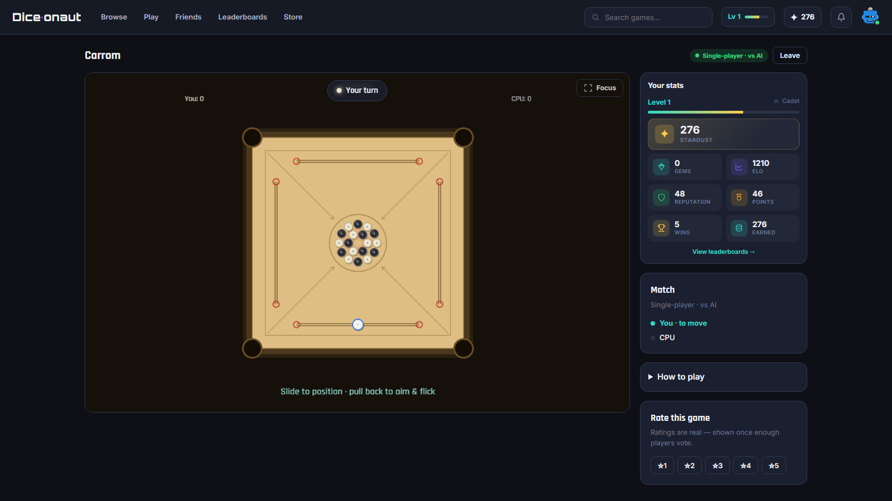
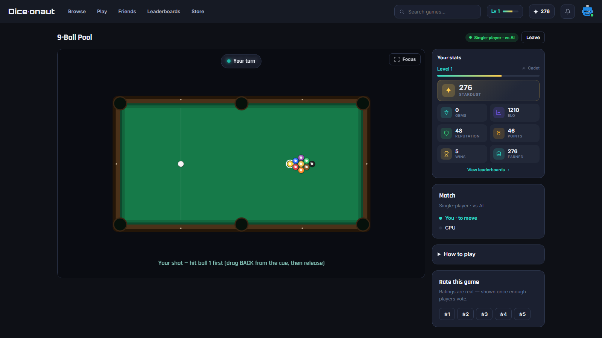

  

<h1 align="center">Diceonaut</h1>

  <b>Free multiplayer board &amp; skill games in your browser &mdash; no download.</b>

  
  
  

---

## The games

Play **online against real players**, **vs AI**, or **pass-and-play** on one device:

|  |  |  |
|:--|:--|:--|
| 🎲 **Ludo** | ⚫ **Carrom** | 🎱 **9-Ball Pool** |
| 🔴 **Connect 4** | 🧱 **Quoridor** | 🪜 **Snakes & Ladders** |
| ⭕ **Gomoku** | ❌ **Tic-Tac-Toe** | 🃏 **Duel Deck** |

## Screenshots

  
  &nbsp;
  

  
  &nbsp;
  

## Features

- 🎲 **9 classic board & skill games** in one place
- 🌐 **Online multiplayer** with real players + private-room challenges (share a link)
- 🤖 Play **vs AI** or offline **pass-and-play**
- 🏆 Per-game and global **leaderboards** + a shared Stardust economy
- 📱 Works on any **phone, tablet or desktop** browser
- 🆓 **Free to play**, nothing to install

## Play now

### &rarr; **[diceonaut.com](https://diceonaut.com/?utm_source=github&utm_medium=referral&utm_campaign=backlinks)**

Pick a game, play instantly. No sign-up needed to start.

---

Diceonaut is published by Atashi Technologies Private Limited.
